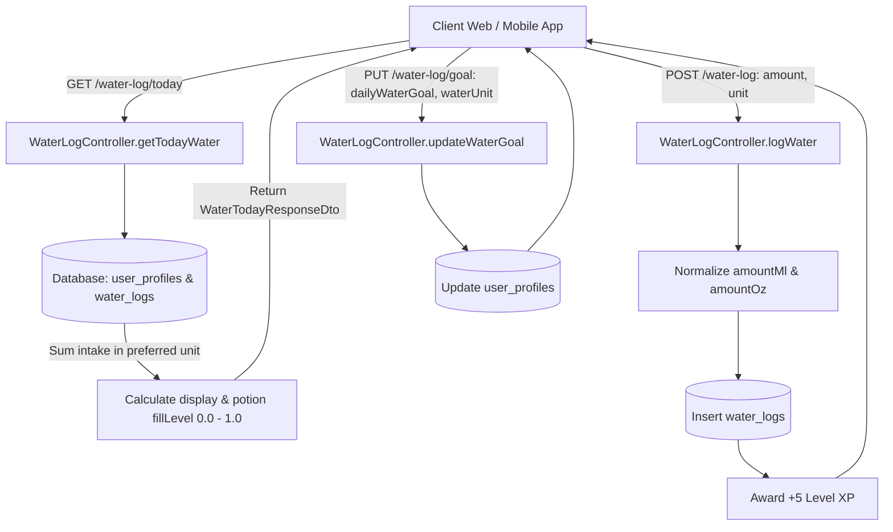
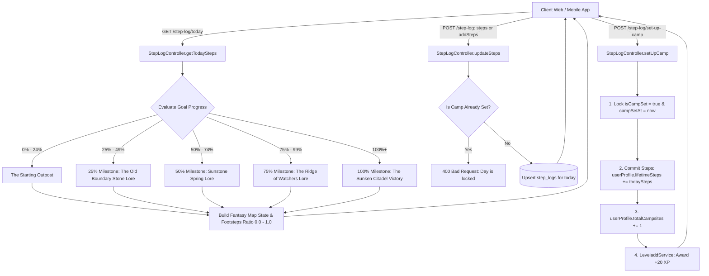

# Master Changes & API Integration Documentation
## Water Tracking, Fantasy Step Journey & Companion Dialogue Engine

**Target Audience:** Frontend Web & Mobile Engineers, Backend Integrators, QA Engineers  
**Base URL:** `http://localhost:3200` (or production API host)  
**Interactive Swagger Docs:** `http://localhost:3200/api-docs`  
**Security Standard:** Bearer JWT Header (`Authorization: Bearer <access_token>`)

---

## 1. Feature Overview & Architecture

This document serves as the authoritative implementation guide for the three newly integrated systems in the **Velvet & Iron** backend:

1. **Water Tracking & Potion Flask Hydration System (`/water-log`)**:
   * Enables users to set personal daily water targets in **US Fluid Ounces (`OZ`)** or **Milliliters (`ML`)**.
   * Normalizes every entry automatically ($1\text{ fl oz} \approx 29.5735\text{ mL}$).
   * Returns a clamped visual liquid fill level (`0.0` to `1.0`) specifically structured for animating the fantasy blue mana potion flask.
   * Awards **+5 XP** per drink and drives the *"Mana Infusion"* daily quest (+20 XP).

2. **Manual Step Tracking, Fantasy Journey Map & "Set Up Camp" Ritual (`/step-log`)**:
   * Allows manual logging and incremental updating of daily steps throughout the day against a personal goal (e.g. `6,842 / 8,000 steps`).
   * **Every step counts toward the cumulative journey**: Even if the daily goal is not reached, 100% of walked steps advance the user across the world map.
   * Unlocks landmark world lore and companion dialogue reactions at **25%, 50%, 75%, and 100%** progress milestones.
   * **The "Set Up Camp" Evening Ritual**: Locks the day's distance, commits steps to cumulative lifetime journey, pitches a campsite marker on the map, and awards **+20 XP**.
   * Powers the *"Step Master"* daily quest (+20 XP).

3. **Deterministic Companion Dialogue & Interaction Engine (`/companions/current/dialogue`)**:
   * A 100% deterministic, high-performance, non-AI contextual dialogue engine.
   * Evaluates real-time user activity across a priority ladder: Inactivity Re-engagement (3+ days) $\rightarrow$ Post-Workout Reaction (last 30m) $\rightarrow$ Post-Meal Reaction (last 30m) $\rightarrow$ Streak-At-Risk (night $\ge 20:00$, 0 logs) $\rightarrow$ Pending Schedule $\rightarrow$ Time of Day (Morning / Afternoon / Evening / Night).
   * Spoken in the canonical voice of the active companion: **Riven**, **Thyra**, **General Leon**, or **Visepheron**.

---

## 2. Complete Route Inventory

| Method | Endpoint | Auth | Role | Description |
|---|---|---|---|---|
| `GET` | `/water-log/today` | Required | User | Get today's water intake vs. goal, potion flask fill level (`0.0 - 1.0`), and presets |
| `POST` | `/water-log` | Required | User | Log a water intake entry (preset or custom amount) |
| `PUT` | `/water-log/goal` | Required | User | Update daily water goal and preferred unit (`OZ` vs. `ML`) |
| `DELETE` | `/water-log/:id` | Required | User | Remove an accidental water intake entry |
| `GET` | `/step-log/today` | Required | User | Get today's steps vs. goal, fantasy map footsteps ratio, landmark lore, and camp status |
| `POST` | `/step-log` | Required | User | Manually enter absolute steps or increment current step tally |
| `POST` | `/step-log/set-up-camp` | Required | User | Perform "Set Up Camp" ritual: lock distance, commit lifetime journey, pitch campsite, award +20 XP |
| `PUT` | `/step-log/goal` | Required | User | Update personal daily step goal (1,000 to 100,000 steps) |
| `GET` | `/step-log/history` | Required | User | Get 30-day historical step and campsite logs for calendar views |
| `GET` | `/companions/current/dialogue`| Required | User | Get context-aware companion dialogue and action prompt for in-app speech bubbles |

---

## 3. End-to-End Workflow Diagrams

### 3.1 Water Intake & Potion Flask Hydration Workflow



### 3.2 Step Tracking, Journey Map & "Set Up Camp" Workflow



---

## 4. Route-by-Route Contracts & Schemas

### 4.1 Water Tracking Endpoints

#### `GET /water-log/today`
* **Headers**: `Authorization: Bearer <token>`
* **Success Response (`200 OK`)**:
```json
{
  "currentIntake": 48.0,
  "goal": 80.0,
  "unit": "OZ",
  "display": "48 / 80 oz",
  "fillPercentage": 60.0,
  "isGoalReached": false,
  "potionFlask": {
    "theme": "mana_potion_blue",
    "fillLevel": 0.60
  },
  "quickAdds": [8, 16, 24, 32],
  "todayLogs": [
    {
      "id": "b3f0980c-04c3-42e8-967a-12a9d6bf3924",
      "amount": 16.0,
      "unit": "OZ",
      "amountMl": 473.18,
      "amountOz": 16.0,
      "earnedXp": 5,
      "loggedAt": "2026-09-23T08:30:00.000Z"
    }
  ]
}
```

#### `POST /water-log`
* **Headers**: `Authorization: Bearer <token>`, `Content-Type: application/json`
* **Request Body (`LogWaterDto`)**:
```json
{
  "amount": 16,
  "unit": "OZ",
  "loggedAt": "2026-09-23T10:15:00.000Z"
}
```
* **Validation**: `amount` must be positive number. `unit` must be `OZ` or `ML` (optional, defaults to profile preference).
* **Success Response (`201 Created`)**:
```json
{
  "id": "f5e1281c-84d2-43f1-a18a-98b7c4ef5512",
  "userId": "4d8a1f22-990a-42c2-80ea-123456789abc",
  "amount": 16.0,
  "unit": "OZ",
  "amountMl": 473.18,
  "amountOz": 16.0,
  "earnedXp": 5,
  "loggedAt": "2026-09-23T10:15:00.000Z"
}
```

#### `PUT /water-log/goal`
* **Headers**: `Authorization: Bearer <token>`, `Content-Type: application/json`
* **Request Body (`UpdateWaterGoalDto`)**:
```json
{
  "dailyWaterGoal": 80,
  "waterUnit": "OZ"
}
```
* **Success Response (`200 OK`)**:
```json
{
  "dailyWaterGoal": 80.0,
  "waterUnit": "OZ",
  "message": "Water goal updated successfully"
}
```

#### `DELETE /water-log/:id`
* **Headers**: `Authorization: Bearer <token>`
* **Success Response (`200 OK`)**: `{ "success": true, "message": "Water log deleted successfully" }`

---

### 4.2 Step Tracking & Journey Endpoints

#### `GET /step-log/today`
* **Headers**: `Authorization: Bearer <token>`
* **Success Response (`200 OK`)**:
```json
{
  "steps": 6842,
  "goal": 8000,
  "display": "6,842 / 8,000 steps",
  "percentage": 85.5,
  "isGoalReached": false,
  "isCampSet": false,
  "campSetAt": null,
  "lifetimeSteps": 45210,
  "totalCampsites": 6,
  "fantasyMap": {
    "currentLandmark": "The Ridge of Watchers",
    "nextLandmark": "The Sunken Citadel",
    "progressRatio": 0.85,
    "unlockedMilestones": [25, 50, 75],
    "activeLore": "Craggy sentinels of stone overlooking the lower valley. From this height, the towers of the destination loom clearly.",
    "companionReaction": "Look ahead. The destination is almost within grasp. Do not disappoint me now."
  }
}
```

#### `POST /step-log`
* **Headers**: `Authorization: Bearer <token>`, `Content-Type: application/json`
* **Request Body (`UpdateStepsDto`)**:
```json
// Option A: Set absolute count
{
  "steps": 6842
}

// Option B: Add incremental count
{
  "addSteps": 1500
}
```
* **Success Response (`200 OK`)**:
```json
{
  "id": "c1f7902e-128a-44c3-b092-887192ab4567",
  "userId": "4d8a1f22-990a-42c2-80ea-123456789abc",
  "steps": 6842,
  "goal": 8000,
  "date": "2026-09-23T00:00:00.000Z",
  "isCampSet": false,
  "campSetAt": null,
  "earnedXp": 0,
  "createdAt": "2026-09-23T08:30:00.000Z",
  "updatedAt": "2026-09-23T14:15:00.000Z"
}
```
* **Error Response (`400 Bad Request`)**:
```json
{
  "statusCode": 400,
  "message": "Camp has already been pitched for today. You cannot modify locked steps.",
  "error": "Bad Request"
}
```

#### `POST /step-log/set-up-camp`
* **Headers**: `Authorization: Bearer <token>`
* **Success Response (`200 OK`)**:
```json
{
  "success": true,
  "isCampSet": true,
  "campSetAt": "2026-09-23T20:30:00.000Z",
  "stepsLocked": 6842,
  "lifetimeSteps": 52052,
  "totalCampsites": 7,
  "earnedXp": 20,
  "message": "Camp pitched successfully! The campfire is lit under the stars."
}
```

#### `PUT /step-log/goal`
* **Headers**: `Authorization: Bearer <token>`, `Content-Type: application/json`
* **Request Body (`UpdateStepGoalDto`)**:
```json
{
  "dailyStepGoal": 10000
}
```
* **Validation**: Min 1,000, Max 100,000.
* **Success Response (`200 OK`)**: `{ "dailyStepGoal": 10000, "message": "Daily step goal updated successfully" }`

#### `GET /step-log/history?limit=30`
* **Headers**: `Authorization: Bearer <token>`
* **Success Response (`200 OK`)**:
```json
[
  {
    "id": "c1f7...",
    "date": "2026-09-23T00:00:00.000Z",
    "steps": 6842,
    "goal": 8000,
    "percentage": 85.5,
    "isGoalReached": false,
    "isCampSet": true,
    "campSetAt": "2026-09-23T20:30:00.000Z",
    "earnedXp": 20
  }
]
```

---

### 4.3 Companion Contextual Dialogue Endpoint

#### `GET /companions/current/dialogue`
* **Headers**: `Authorization: Bearer <token>`
* **Description**: Returns dynamic in-app speech bubble dialogue spoken by the user's active companion, tailored to their recent workout, meal, streak state, or time of day.
* **Success Response (`200 OK`)**:
```json
{
  "companion": {
    "id": "companion-uuid-1",
    "name": "Riven",
    "slug": "riven",
    "title": "High Lord of the Forsaken Court",
    "quote": "Come now. We have things to accomplish."
  },
  "triggerContext": "POST_WORKOUT",
  "text": "Good form. Empires are built on sweat and ambition.",
  "actionPrompt": "Log Your Meal",
  "timestamp": "2026-09-23T10:15:00.000Z"
}
```

---

## 5. Executable cURL Test Suite

```bash
# 1. Fetch Today's Water Progress
curl -X GET "http://localhost:3200/water-log/today" \
  -H "Authorization: Bearer YOUR_ACCESS_TOKEN"

# 2. Log Quick-Add Water (+16 oz)
curl -X POST "http://localhost:3200/water-log" \
  -H "Authorization: Bearer YOUR_ACCESS_TOKEN" \
  -H "Content-Type: application/json" \
  -d '{"amount": 16, "unit": "OZ"}'

# 3. Update Daily Water Goal (80 oz)
curl -X PUT "http://localhost:3200/water-log/goal" \
  -H "Authorization: Bearer YOUR_ACCESS_TOKEN" \
  -H "Content-Type: application/json" \
  -d '{"dailyWaterGoal": 80, "waterUnit": "OZ"}'

# 4. Fetch Today's Step Progress & Map State
curl -X GET "http://localhost:3200/step-log/today" \
  -H "Authorization: Bearer YOUR_ACCESS_TOKEN"

# 5. Log Steps (Absolute count)
curl -X POST "http://localhost:3200/step-log" \
  -H "Authorization: Bearer YOUR_ACCESS_TOKEN" \
  -H "Content-Type: application/json" \
  -d '{"steps": 6842}'

# 6. Execute "Set Up Camp" Ritual
curl -X POST "http://localhost:3200/step-log/set-up-camp" \
  -H "Authorization: Bearer YOUR_ACCESS_TOKEN"

# 7. Update Daily Step Goal
curl -X PUT "http://localhost:3200/step-log/goal" \
  -H "Authorization: Bearer YOUR_ACCESS_TOKEN" \
  -H "Content-Type: application/json" \
  -d '{"dailyStepGoal": 10000}'

# 8. Fetch Companion Contextual Dialogue
curl -X GET "http://localhost:3200/companions/current/dialogue" \
  -H "Authorization: Bearer YOUR_ACCESS_TOKEN"
```

---

## 6. Business, Mathematical & Calculation Rules

1. **Dual-Unit Normalization**:
   * Conversion formula: $1\text{ fl oz} = 29.5735\text{ mL}$.
   * Both `amountMl` and `amountOz` are stored in every `water_logs` record. When toggling preferred unit via `PUT /water-log/goal`, historical data is recalculated automatically without precision loss.
2. **Potion Flask Liquid Clamping**:
   * While `fillPercentage` can exceed $100\%$ (e.g. $125\%$), `potionFlask.fillLevel` is strictly clamped between `0.0` and `1.0` to prevent visual overflow in liquid graphics.
3. **Cumulative Step Journey Philosophy**:
   * **Every step counts**: Even if a user's goal is 10,000 and they walk 6,000 steps, all 6,000 steps travel forward on the map and commit to `userProfile.lifetimeSteps` upon setting up camp.
4. **"Set Up Camp" Lockdown**:
   * Once camp is pitched (`isCampSet === true`), the step count is locked for that calendar date. Any subsequent `POST /step-log` calls return a `400 Bad Request`.
5. **Gamification & Daily Quest Integration**:
   * Water Intake: **+5 XP** per entry.
   * Setting Up Camp: **+20 XP**.
   * Daily Quest *"Mana Infusion"*: Awards **+20 XP** upon reaching $\ge 80\%$ of daily water goal.
   * Daily Quest *"Step Master"*: Awards **+20 XP** upon reaching daily step goal or walking $\ge 8,000$ steps.

---

## 7. Frontend (Web / Mobile App) Implementation Guide

*(This guide details the conceptual lifecycle, state management, and UI visual mapping without presenting frontend code).*

### 7.1 Screen Mounting & Lifecycle
* **App Launch / Dashboard Mount**:
  * Execute parallel queries for `GET /water-log/today`, `GET /step-log/today`, and `GET /companions/current/dialogue`.
* **Foreground Resume**:
  * On mobile devices, when the app returns from background after midnight, invalidate and refetch all three endpoints to reset daily trackers to the new day's initial state.

### 7.2 Fantasy Potion Flask UI
* **Layering**:
  * Place the static potion flask bottle artwork on the base layer.
  * Inside or behind the bottle mask, position a blue vertical liquid fill (or animated wave shader).
  * Bind the vertical height or mask position of the liquid layer to `potionFlask.fillLevel` (`0.0` = empty base, `1.0` = full up to bottle neck).
  * Render the display text (e.g. `"48 / 80 oz"`) across the bottle label.
* **Quick-Add Buttons**:
  * Render buttons dynamically from `quickAdds` response array (e.g. `+8 oz`, `+16 oz`).
  * Tapping sends `POST /water-log`. Apply an optimistic increment to the liquid height immediately, rolling back with a toast if network fails.

### 7.3 Aged Fantasy Map & Footstep Path
* **Winding Route Visual**:
  * Render an aged parchment / leather map graphic containing a winding trail leading from an outpost to a castle/citadel.
  * Bind the length of footsteps rendered along the trail directly to `fantasyMap.progressRatio` ($0.0$ to $1.0$).
* **Milestone Pins & Lore Scrolls**:
  * Place landmark icons at 25%, 50%, 75%, and 100% of the trail.
  * Highlight unlocked pins according to `fantasyMap.unlockedMilestones`.
  * Display a parchment lore scroll card containing `fantasyMap.activeLore` and `fantasyMap.companionReaction`.

### 7.4 The "Set Up Camp" Ritual Ceremony
* **Button State**:
  * If `isCampSet` is `false`, render an active **"🏕️ Set Up Camp"** button.
  * If `isCampSet` is `true`, disable the button and show a serene status banner: *"Camp Pitched for the Night"*.
* **Ceremony Flow**:
  * Tapping prompts a brief confirmation: *"Finished walking for today? This will record your journey and pitch camp."*
  * On confirmation, call `POST /step-log/set-up-camp`.
  * Play an animation placing a pitched tent with crackling campfire flames right at the final position of the footsteps.
  * Show an XP reward popup: `+20 XP Earned!`.

### 7.5 Companion Speech Bubble
* Place the companion speech bubble above the companion avatar on the main dashboard.
* Populate the bubble text with `text` from `GET /companions/current/dialogue`.
* If `actionPrompt` is present (e.g. `"Log Your Meal"` or `"Check Daily Goals"`), render it as an interactive button inside the bubble that navigates directly to that feature screen.
