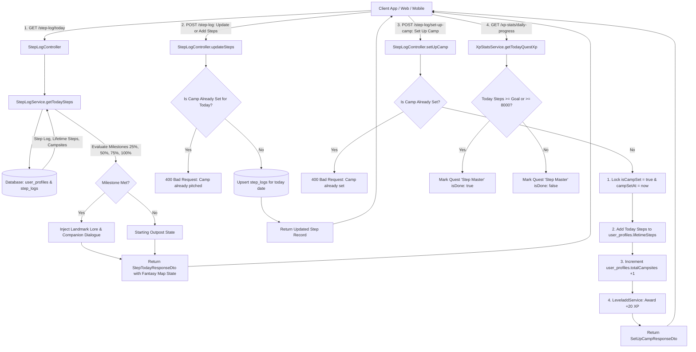

# Step Journey, Fantasy Map & "Set Up Camp" Workflow

## 1. Feature Name
Manual Step Tracking, Fantasy Journey Map & "Set Up Camp" Ritual (V1)

---

## 2. Short Description
A fantasy-immersive physical activity tracking feature for Velvet & Iron. Users can set their own daily step goals, manually enter or increment steps throughout the day, and watch their footprints travel along a winding path on an aged fantasy map toward landmarks and destinations. Progress triggers world lore and companion dialogue milestones at 25%, 50%, 75%, and 100%. When finished walking for the day, users initiate the **"Set Up Camp"** ritual—locking their day's distance, permanently committing all steps to their cumulative lifetime journey, pitching a campsite marker on the map, and earning bonus completion XP.

---

## 3. Actors
* **Authenticated User**: Any user holding a valid JWT access token and active user profile.
* **Companion Engine**: Delivers in-character companion reactions (Riven, Thyra, General Leon, Visepheron) when landmark milestones are unlocked.
* **Gamification Engine**: Evaluates level XP (+20 XP for setting up camp) and completes the *"Step Master"* daily quest upon hitting goal.

---

## 4. Preconditions
* User account exists, is active, and verified.
* User profile (`user_profiles`) has been initialized (`dailyStepGoal = 8000`, `lifetimeSteps = 0`, `totalCampsites = 0`).
* Request includes `Authorization: Bearer <access_token>`.

---

## 5. Workflow Diagram



---

## 6. Route Inventory

| Method | Route | Authentication | Authorization | Description |
|---|---|---|---|---|
| `GET` | `/step-log/today` | Required (Bearer JWT) | Authenticated User | Get today's steps vs. goal, fantasy map footsteps position, unlocked lore, and camp status |
| `POST` | `/step-log` | Required (Bearer JWT) | Authenticated User | Enter absolute steps or increment steps throughout the day |
| `POST` | `/step-log/set-up-camp` | Required (Bearer JWT) | Authenticated User | Finalize day's walk: lock distance, pitch campsite, add steps to cumulative lifetime journey, award +20 XP |
| `PUT` | `/step-log/goal` | Required (Bearer JWT) | Authenticated User | Update personal daily step goal (between 1,000 and 100,000 steps) |
| `GET` | `/step-log/history` | Required (Bearer JWT) | Authenticated User | Get 30-day step history, completion status, and campsite logs for calendar views |

---

## 7. Route-by-Route Contracts & Schemas

### Route 1: `GET /step-log/today`

#### Description
Returns today's step count, daily target goal, human-readable display string, percentage, campsite status, cumulative lifetime steps, and fantasy map coordinates including footsteps progress ratio (`0.0` to `1.0`), landmark names, active lore, and companion reactions.

#### Request Headers
```json
{
  "Authorization": "Bearer <access_token>",
  "Accept": "application/json"
}
```

#### Response Fields (`StepTodayResponseDto`)
| Field | Type | Description | Example |
|---|---|---|---|
| `steps` | integer | Current steps accumulated today | `6842` |
| `goal` | integer | Daily personal target goal | `8000` |
| `display` | string | Human-readable progress string | `"6,842 / 8,000 steps"` |
| `percentage` | number | Percentage of daily goal completed | `85.5` |
| `isGoalReached` | boolean | True if `steps >= goal` | `false` |
| `isCampSet` | boolean | True if the user has performed the "Set Up Camp" ritual today | `false` |
| `campSetAt` | string (ISO Date) \| null | Timestamp when camp was pitched, or null | `null` |
| `lifetimeSteps` | integer | Cumulative steps walked across all days | `45210` |
| `totalCampsites` | integer | Total times camp has been pitched in account history | `6` |
| `fantasyMap` | object | Metadata specifically for rendering footsteps and landmarks | `{...}` |
| `fantasyMap.currentLandmark` | string | Name of the last landmark unlocked | `"The Ridge of Watchers"` |
| `fantasyMap.nextLandmark` | string | Name of the upcoming destination | `"The Sunken Citadel"` |
| `fantasyMap.progressRatio` | number | Normalized footprint progress along trail clamped to `0.0 - 1.0` | `0.85` |
| `fantasyMap.unlockedMilestones` | integer[] | Milestone percentages achieved (`[25, 50, 75, 100]`) | `[25, 50, 75]` |
| `fantasyMap.activeLore` | string | Lore narrative describing the current territory reached | `"Craggy sentinels of stone overlooking the lower valley..."` |
| `fantasyMap.companionReaction` | string | Companion dialogue reaction for the reached landmark | `"Look ahead. The destination is almost within grasp..."` |

#### Success Response Sample (`200 OK`)
```json
{
  "steps": 6842,
  "goal": 8000,
  "display": "6,842 / 8,000 steps",
  "percentage": 85.5,
  "isGoalReached": false,
  "isCampSet": false,
  "campSetAt": null,
  "lifetimeSteps": 45210,
  "totalCampsites": 6,
  "fantasyMap": {
    "currentLandmark": "The Ridge of Watchers",
    "nextLandmark": "The Sunken Citadel",
    "progressRatio": 0.85,
    "unlockedMilestones": [25, 50, 75],
    "activeLore": "Craggy sentinels of stone overlooking the lower valley. From this height, the towers of the destination loom clearly.",
    "companionReaction": "Look ahead. The destination is almost within grasp. Do not disappoint me now."
  }
}
```

---

### Route 2: `POST /step-log`

#### Description
Manually records or updates the step count for the current day. Accepts either an absolute number (e.g. `6842`) or an incremental addition (e.g. `addSteps: 1500`). Updates are blocked once camp has been set for that day.

#### Request Headers
```json
{
  "Authorization": "Bearer <access_token>",
  "Content-Type": "application/json"
}
```

#### Request Body Fields (`UpdateStepsDto`)
| Field | Type | Required | Nullable | Validation | Description |
|---|---|---|---|---|---|
| `steps` | integer | Optional* | No | `@IsInt()`, `@Min(0)` | Set absolute step count for the day |
| `addSteps` | integer | Optional* | No | `@IsInt()`, `@IsPositive()` | Add steps to the current count |
| `date` | string | No | No | `@IsString()` | Target date (`YYYY-MM-DD`). Defaults to current date |

*\*At least one of `steps` or `addSteps` must be provided.*

#### Request Body Samples
```json
// Setting absolute count:
{
  "steps": 6842
}

// Adding incremental steps:
{
  "addSteps": 1500
}
```

#### Success Response Sample (`200 OK`)
```json
{
  "id": "c1f7902e-128a-44c3-b092-887192ab4567",
  "userId": "4d8a1f22-990a-42c2-80ea-123456789abc",
  "steps": 6842,
  "goal": 8000,
  "date": "2026-09-23T00:00:00.000Z",
  "isCampSet": false,
  "campSetAt": null,
  "earnedXp": 0,
  "createdAt": "2026-09-23T08:30:00.000Z",
  "updatedAt": "2026-09-23T14:15:00.000Z"
}
```

#### Error Responses
* **400 Bad Request**: Attempting to log steps after setting camp
  ```json
  {
    "statusCode": 400,
    "message": "Camp has already been pitched for today. You cannot modify locked steps.",
    "error": "Bad Request"
  }
  ```

---

### Route 3: `POST /step-log/set-up-camp`

#### Description
Executes the evening **"Set Up Camp"** ritual. Locks today's step count, commits today's steps to the user's permanent `lifetimeSteps` tally, increments `totalCampsites`, pitches a campsite icon on the fantasy map, and awards **+20 XP**.

#### Request Headers
```json
{
  "Authorization": "Bearer <access_token>"
}
```

#### Success Response Sample (`200 OK`)
```json
{
  "success": true,
  "isCampSet": true,
  "campSetAt": "2026-09-23T20:30:00.000Z",
  "stepsLocked": 6842,
  "lifetimeSteps": 52052,
  "totalCampsites": 7,
  "earnedXp": 20,
  "message": "Camp pitched successfully! The campfire is lit under the stars."
}
```

#### Error Responses
* **400 Bad Request**: Camp already set today
  ```json
  {
    "statusCode": 400,
    "message": "You have already set up camp for today.",
    "error": "Bad Request"
  }
  ```

---

### Route 4: `PUT /step-log/goal`

#### Description
Updates the user's personal daily step goal (stored in `UserProfile.dailyStepGoal`).

#### Request Headers
```json
{
  "Authorization": "Bearer <access_token>",
  "Content-Type": "application/json"
}
```

#### Request Body Fields (`UpdateStepGoalDto`)
| Field | Type | Required | Validation | Description |
|---|---|---|---|---|
| `dailyStepGoal` | integer | **Yes** | `@IsInt()`, `@Min(1000)`, `@Max(100000)` | Target daily step count |

#### Request Body Sample
```json
{
  "dailyStepGoal": 10000
}
```

#### Success Response Sample (`200 OK`)
```json
{
  "dailyStepGoal": 10000,
  "message": "Daily step goal updated successfully"
}
```

---

### Route 5: `GET /step-log/history`

#### Description
Returns an array of historical daily step logs, goals, completion percentages, and campsite timestamps (up to 60 days, default 30) for history and calendar screens.

#### Request Headers
```json
{
  "Authorization": "Bearer <access_token>",
  "Accept": "application/json"
}
```

#### Query Parameters
| Parameter | Type | Required | Default | Description |
|---|---|---|---|---|
| `limit` | integer | No | `30` | Number of days to retrieve (1 to 60) |

#### Success Response Sample (`200 OK`)
```json
[
  {
    "id": "c1f7...",
    "date": "2026-09-23T00:00:00.000Z",
    "steps": 6842,
    "goal": 8000,
    "percentage": 85.5,
    "isGoalReached": false,
    "isCampSet": true,
    "campSetAt": "2026-09-23T20:30:00.000Z",
    "earnedXp": 20
  },
  {
    "id": "e4b2...",
    "date": "2026-09-22T00:00:00.000Z",
    "steps": 10240,
    "goal": 8000,
    "percentage": 128.0,
    "isGoalReached": true,
    "isCampSet": true,
    "campSetAt": "2026-09-22T21:15:00.000Z",
    "earnedXp": 20
  }
]
```

---

## 8. cURL Samples

### 1. Fetch Today's Step Progress & Fantasy Map State
```bash
curl -X GET "http://localhost:3200/step-log/today" \
  -H "Authorization: Bearer YOUR_ACCESS_TOKEN" \
  -H "Accept: application/json"
```

### 2. Enter Steps (Absolute Number)
```bash
curl -X POST "http://localhost:3200/step-log" \
  -H "Authorization: Bearer YOUR_ACCESS_TOKEN" \
  -H "Content-Type: application/json" \
  -d '{
    "steps": 6842
  }'
```

### 3. Increment Steps (+1500)
```bash
curl -X POST "http://localhost:3200/step-log" \
  -H "Authorization: Bearer YOUR_ACCESS_TOKEN" \
  -H "Content-Type: application/json" \
  -d '{
    "addSteps": 1500
  }'
```

### 4. Execute "Set Up Camp" Ritual
```bash
curl -X POST "http://localhost:3200/step-log/set-up-camp" \
  -H "Authorization: Bearer YOUR_ACCESS_TOKEN"
```

### 5. Update Daily Step Goal
```bash
curl -X PUT "http://localhost:3200/step-log/goal" \
  -H "Authorization: Bearer YOUR_ACCESS_TOKEN" \
  -H "Content-Type: application/json" \
  -d '{
    "dailyStepGoal": 10000
  }'
```

### 6. View Step History for Calendar
```bash
curl -X GET "http://localhost:3200/step-log/history?limit=14" \
  -H "Authorization: Bearer YOUR_ACCESS_TOKEN"
```

---

## 9. Business & Calculation Rules

1. **Every Step Counts Toward the Cumulative Journey**:
   * Personal goals determine daily quest completion, but **never restrict distance traveled on the map**.
   * If a user sets an 8,000-step goal and walks 5,500 steps, all 5,500 steps travel forward on the map and commit to `lifetimeSteps` when setting up camp.
2. **"Set Up Camp" Locking Mechanism**:
   * Once a user taps "Set Up Camp", `isCampSet` becomes `true`.
   * Any subsequent `POST /step-log` updates on that day are blocked with a `400 Bad Request` to preserve the integrity of the campsite distance.
   * `campSetAt` records the exact evening timestamp when the camp was established.
3. **Landmark Lore & Companion Dialogue Unlocks**:
   * **0% - 24%**: *The Starting Outpost* — traveler preparing for the march.
   * **25% - 49%**: *The Old Boundary Stone* — crossing the frontier into the wilds.
   * **50% - 74%**: *Sunstone Spring* — midway oasis refilling flasks.
   * **75% - 99%**: *The Ridge of Watchers* — high lookout seeing the citadel towers.
   * **100%+**: *The Sunken Citadel* — destination secured in triumph.
4. **Gamification & Quest Integration**:
   * Performing "Set Up Camp" awards **+20 XP** towards character leveling.
   * In `GET /xp-stats/daily-progress`, the daily quest **`"step-master"`** automatically marks `isDone: true` when `todaySteps >= goal` or `todaySteps >= 8000`.

---

## 10. Frontend (Web / App) Integration Guide

*(This guide outlines the conceptual lifecycle, state management, and UI visual mapping without presenting frontend code).*

### A. Lifecycle & Screen Loading
1. **Initial Mount / Dashboard**:
   * Execute `GET /step-log/today`.
   * Store the returned `steps`, `goal`, `display`, and `fantasyMap` in your step store.
2. **Date Change / Foreground Resume**:
   * When the mobile application resumes on a new calendar day, re-fetch `GET /step-log/today` to reset the daily journey to the new day's trail.

### B. Rendering the Aged Fantasy Map & Footsteps
1. **Visual Elements**:
   * **Background Asset**: Render the parchment / aged leather fantasy world map graphic.
   * **Winding Trail**: An SVG path or bezier curve leading from the starting outpost through the landmarks to the citadel.
   * **Footstep Dots / Icons**: Position a trail of footprint icons along the SVG curve. The length of the rendered footsteps directly binds to `fantasyMap.progressRatio` ($0.0$ to $1.0$).
   * **Landmark Markers**: Render 4 landmark pins at 25%, 50%, 75%, and 100% of the trail path. Highlight reached landmarks using the numbers in `fantasyMap.unlockedMilestones`.
   * **Lore Scroll / Bubble**: Beneath or overlaying the map, render a parchment scroll displaying `fantasyMap.activeLore` and the companion quote `fantasyMap.companionReaction`.

### C. Manual Step Entry & Quick Increment
1. **Update Button / Stepper**:
   * Allow users to tap on their step count or an "Update Steps" button.
   * Offer quick increment buttons (e.g. `+1,000`, `+2,500`, `+5,000`) or a numeric keypad to input their current pedometer reading.
   * Tapping submits `POST /step-log` with `{ steps: newTotal }`.
2. **Map Animation**:
   * Upon successful update, smoothly animate the footsteps moving farther along the winding trail to the new `progressRatio`.

### D. The "Set Up Camp" Ritual Button & Animation
1. **Button State**:
   * When `isCampSet` is `false`, render a prominent action button: **"🏕️ Set Up Camp"** (often displayed with a tent or campfire icon).
   * When `isCampSet` is `true`, disable the button or replace it with a peaceful status badge: *"Camp Pitched for the Night"*.
2. **Ritual Ceremony**:
   * Tapping the button opens a brief confirmation modal: *"Are you finished walking for today? This will pitch your camp and record your journey."*
   * On confirmation, call `POST /step-log/set-up-camp`.
   * **Visual Effect**: Place an animated campsite tent with crackling campfire flames right at the final position of the footsteps. Play a gentle campfire sound or haptic vibration.
   * Display an XP badge popup: `+20 XP Earned!`.

### E. Calendar / History Screen
1. On the Calendar or History view, execute `GET /step-log/history`.
2. For each past day, render a compact day card showing:
   * Total steps walked vs. goal.
   * A small tent icon if `isCampSet === true`.
   * A victory star if `isGoalReached === true`.

