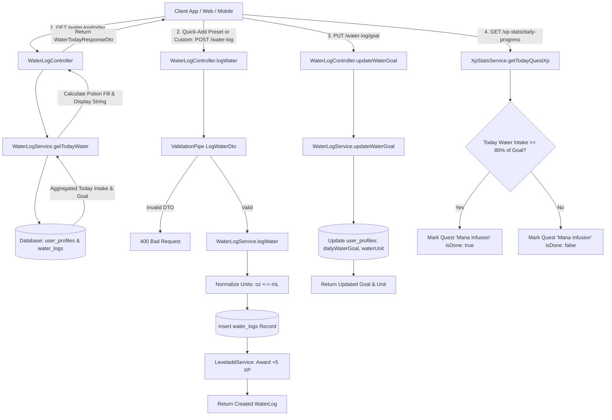

# Water Tracking & Potion Flask Hydration Workflow

## 1. Feature Name
Water Intake & Potion Flask Hydration Tracking

---

## 2. Short Description
A core health logging feature allowing users to record their daily water consumption, customize their daily hydration targets in US Fluid Ounces (`OZ`) or Milliliters (`ML`), and monitor their intake through a fantasy-themed blue mana potion flask visual progress indicator. Every water intake log contributes gamification experience points (XP) towards character leveling and progresses the *"Mana Infusion"* daily quest.

---

## 3. Actors
* **Authenticated User**: Any user who possesses a valid JWT access token and has an active user profile.
* **System / Gamification Engine**: Evaluates level milestones, awards XP (+5 XP per drink entry), and marks the daily hydration quest complete upon reaching ≥ 80% of daily target.

---

## 4. Preconditions
* User account must exist in the database and be active.
* User must provide a valid `Authorization: Bearer <access_token>` header on all requests.
* User profile (`user_profiles`) must be initialized with default goals (`dailyWaterGoal = 64`, `waterUnit = OZ`).

---

## 5. Workflow Diagram



---

## 6. Route Inventory

| Method | Route | Authentication | Authorization | Description |
|---|---|---|---|---|
| `GET` | `/water-log/today` | Required (Bearer JWT) | Authenticated User | Get current day's intake vs. goal, potion flask fill level, and drink timeline |
| `POST` | `/water-log` | Required (Bearer JWT) | Authenticated User | Log a new water intake entry (preset or custom) |
| `PUT` | `/water-log/goal` | Required (Bearer JWT) | Authenticated User | Update user's daily water goal and preferred measurement unit |
| `DELETE` | `/water-log/:id` | Required (Bearer JWT) | Authenticated User | Delete an accidental water intake log by ID |

---

## 7. Route-by-Route Contracts & Schemas

### Route 1: `GET /water-log/today`

#### Description
Returns today's aggregate water intake calculated in the user's preferred measurement unit, their target goal, the visual fill level for the blue potion flask, quick-add preset buttons, and individual logs recorded today.

#### Authentication & Authorization
* **Authentication**: Required (`JWT-auth`)
* **Authorization**: Authenticated user

#### Request Headers
```json
{
  "Authorization": "Bearer <access_token>",
  "Accept": "application/json"
}
```

#### Request Parameters & Body
* **Path Parameters**: None
* **Query Parameters**: None
* **Request Body**: None

#### Response Fields (`WaterTodayResponseDto`)
| Field | Type | Description | Example |
|---|---|---|---|
| `currentIntake` | number | Total water consumed today in user's preferred unit | `48.0` |
| `goal` | number | Daily goal in user's preferred unit | `80.0` |
| `unit` | enum (`OZ` \| `ML`) | User's preferred unit | `"OZ"` |
| `display` | string | Human-readable progress string | `"48 / 80 oz"` |
| `fillPercentage` | number | Percentage of goal achieved (rounded to 1 decimal) | `60.0` |
| `isGoalReached` | boolean | True if `currentIntake >= goal` | `false` |
| `potionFlask` | object | Metadata specifically for rendering the potion flask UI | `{"theme": "mana_potion_blue", "fillLevel": 0.60}` |
| `potionFlask.theme` | string | Aesthetic theme identifier | `"mana_potion_blue"` |
| `potionFlask.fillLevel` | number | Normalized liquid fill level between `0.0` and `1.0` (clamped) | `0.60` |
| `quickAdds` | number[] | Recommended quick-add increments tailored to preferred unit | `[8, 16, 24, 32]` |
| `todayLogs` | array | List of individual water logs recorded today | `[...]` |
| `todayLogs[].id` | string (UUID) | Unique log ID | `"7b920f60-..."` |
| `todayLogs[].amount` | number | Entered amount | `16.0` |
| `todayLogs[].unit` | enum (`OZ` \| `ML`) | Unit used when logged | `"OZ"` |
| `todayLogs[].amountMl` | number | Normalized volume in milliliters | `473.18` |
| `todayLogs[].amountOz` | number | Normalized volume in fluid ounces | `16.0` |
| `todayLogs[].earnedXp` | integer | XP awarded for this log entry | `5` |
| `todayLogs[].loggedAt` | string (ISO Date) | Timestamp of entry | `"2026-09-23T08:30:00.000Z"` |

#### Success Response Sample (`200 OK`)
```json
{
  "currentIntake": 48.0,
  "goal": 80.0,
  "unit": "OZ",
  "display": "48 / 80 oz",
  "fillPercentage": 60.0,
  "isGoalReached": false,
  "potionFlask": {
    "theme": "mana_potion_blue",
    "fillLevel": 0.60
  },
  "quickAdds": [8, 16, 24, 32],
  "todayLogs": [
    {
      "id": "b3f0980c-04c3-42e8-967a-12a9d6bf3924",
      "amount": 16.0,
      "unit": "OZ",
      "amountMl": 473.18,
      "amountOz": 16.0,
      "earnedXp": 5,
      "loggedAt": "2026-09-23T08:30:00.000Z"
    },
    {
      "id": "f5e1281c-84d2-43f1-a18a-98b7c4ef5512",
      "amount": 32.0,
      "unit": "OZ",
      "amountMl": 946.35,
      "amountOz": 32.0,
      "earnedXp": 5,
      "loggedAt": "2026-09-23T11:45:00.000Z"
    }
  ]
}
```

---

### Route 2: `POST /water-log`

#### Description
Logs a water drink entry. Normalizes amounts into both milliliters and ounces, stores the record, and awards experience points (+5 XP).

#### Authentication & Authorization
* **Authentication**: Required (`JWT-auth`)
* **Authorization**: Authenticated user

#### Request Headers
```json
{
  "Authorization": "Bearer <access_token>",
  "Content-Type": "application/json"
}
```

#### Request Body Fields (`LogWaterDto`)
| Field | Type | Required | Nullable | Enum | Validation | Description |
|---|---|---|---|---|---|---|
| `amount` | number | **Yes** | No | — | `@IsNumber()`, `@IsPositive()` | Volume consumed (e.g., `8`, `16`, `250`, `500`) |
| `unit` | enum | No | No | `OZ`, `ML` | `@IsOptional()`, `@IsEnum(WaterUnit)` | Unit of entered amount. Defaults to user's preferred unit if omitted |
| `loggedAt` | string | No | No | — | `@IsOptional()`, `@IsString()` | Custom ISO 8601 timestamp. Defaults to `now()` |

#### Request Body Sample
```json
{
  "amount": 16,
  "unit": "OZ",
  "loggedAt": "2026-09-23T11:45:00.000Z"
}
```

#### Success Response Sample (`201 Created`)
```json
{
  "id": "f5e1281c-84d2-43f1-a18a-98b7c4ef5512",
  "userId": "4d8a1f22-990a-42c2-80ea-123456789abc",
  "amount": 16.0,
  "unit": "OZ",
  "amountMl": 473.18,
  "amountOz": 16.0,
  "earnedXp": 5,
  "loggedAt": "2026-09-23T11:45:00.000Z"
}
```

#### Error Responses
* **400 Bad Request**: Invalid body parameters
  ```json
  {
    "statusCode": 400,
    "message": ["amount must be a positive number"],
    "error": "Bad Request"
  }
  ```
* **401 Unauthorized**: Missing or expired JWT token
  ```json
  {
    "statusCode": 401,
    "message": "Unauthorized"
  }
  ```

---

### Route 3: `PUT /water-log/goal`

#### Description
Allows the user to adjust their daily target volume and select their preferred measurement unit (`OZ` vs. `ML`).

#### Authentication & Authorization
* **Authentication**: Required (`JWT-auth`)
* **Authorization**: Authenticated user

#### Request Headers
```json
{
  "Authorization": "Bearer <access_token>",
  "Content-Type": "application/json"
}
```

#### Request Body Fields (`UpdateWaterGoalDto`)
| Field | Type | Required | Nullable | Enum | Validation | Description |
|---|---|---|---|---|---|---|
| `dailyWaterGoal` | number | **Yes** | No | — | `@IsNumber()`, `@IsPositive()` | Target intake (e.g. `64` or `80` for oz; `2000` for mL) |
| `waterUnit` | enum | **Yes** | No | `OZ`, `ML` | `@IsEnum(WaterUnit)` | Preferred unit of measurement |

#### Request Body Sample
```json
{
  "dailyWaterGoal": 80,
  "waterUnit": "OZ"
}
```

#### Success Response Sample (`200 OK`)
```json
{
  "dailyWaterGoal": 80.0,
  "waterUnit": "OZ",
  "message": "Water goal updated successfully"
}
```

---

### Route 4: `DELETE /water-log/:id`

#### Description
Deletes an individual water log entry belonging to the authenticated user.

#### Authentication & Authorization
* **Authentication**: Required (`JWT-auth`)
* **Authorization**: Resource owner (only logs created by the user can be deleted)

#### Request Headers
```json
{
  "Authorization": "Bearer <access_token>"
}
```

#### Path Parameters
| Parameter | Type | Required | Description |
|---|---|---|---|
| `id` | string (UUID) | **Yes** | The unique identifier of the water log record to delete |

#### Success Response Sample (`200 OK`)
```json
{
  "success": true,
  "message": "Water log deleted successfully"
}
```

#### Error Responses
* **404 Not Found**: Record does not exist or belongs to another user
  ```json
  {
    "statusCode": 404,
    "message": "Water log not found",
    "error": "Not Found"
  }
  ```

---

## 8. cURL Samples

### 1. Fetch Today's Water Progress & Potion Flask Level
```bash
curl -X GET "http://localhost:3200/water-log/today" \
  -H "Authorization: Bearer YOUR_ACCESS_TOKEN" \
  -H "Accept: application/json"
```

### 2. Log Water via Quick-Add / Preset Amount
```bash
curl -X POST "http://localhost:3200/water-log" \
  -H "Authorization: Bearer YOUR_ACCESS_TOKEN" \
  -H "Content-Type: application/json" \
  -d '{
    "amount": 16,
    "unit": "OZ"
  }'
```

### 3. Log Custom Water Amount with Custom Timestamp
```bash
curl -X POST "http://localhost:3200/water-log" \
  -H "Authorization: Bearer YOUR_ACCESS_TOKEN" \
  -H "Content-Type: application/json" \
  -d '{
    "amount": 24,
    "unit": "OZ",
    "loggedAt": "2026-09-23T10:15:00.000Z"
  }'
```

### 4. Update Daily Water Goal & Unit
```bash
curl -X PUT "http://localhost:3200/water-log/goal" \
  -H "Authorization: Bearer YOUR_ACCESS_TOKEN" \
  -H "Content-Type: application/json" \
  -d '{
    "dailyWaterGoal": 80,
    "waterUnit": "OZ"
  }'
```

### 5. Delete an Accidental Water Entry
```bash
curl -X DELETE "http://localhost:3200/water-log/b3f0980c-04c3-42e8-967a-12a9d6bf3924" \
  -H "Authorization: Bearer YOUR_ACCESS_TOKEN"
```

---

## 9. Business & Calculation Rules

1. **Dual-Unit Normalization**:
   * Standard conversion factor: $1\text{ fl oz} = 29.5735\text{ mL}$.
   * Regardless of whether the client submits `OZ` or `ML`, the backend automatically calculates and stores both `amountMl` and `amountOz` in `water_logs`.
   * When returning `GET /water-log/today`, the sum is computed dynamically in the user's currently configured `waterUnit`. If a user switches from `OZ` to `ML`, past logs automatically recalculate into the new unit without loss of precision.
2. **Potion Flask Liquid Clamping**:
   * The `fillPercentage` represents the real percentage and can exceed $100\%$ (e.g., $125\%$).
   * The `potionFlask.fillLevel` is strictly clamped between `0.0` (empty) and `1.0` (full) to prevent rendering overflows in mobile/web liquid container graphics.
3. **Gamification & Daily Quest Integration**:
   * Each entry awards **+5 XP** towards character leveling.
   * In `GET /xp-stats/daily-progress`, the daily quest **`"mana-infusion"`** (*"Mana Infusion: Drink at least 80% of your daily water potion goal"*) awards **+20 XP** and automatically resolves to `isDone: true` once `todayWaterIntake >= (goal * 0.8)`.

---

## 10. Frontend (Web / App) Integration Guide

*(This guide outlines the conceptual lifecycle, state management, and UI visual mapping without presenting frontend code).*

### A. Lifecycle & Screen Loading
1. **Initial Dashboard Mount**:
   * Upon opening the app or navigating to the Dashboard, execute `GET /water-log/today`.
   * Store the returned `currentIntake`, `goal`, `display`, and `potionFlask` in your global/screen hydration state.
2. **Foreground App Resume**:
   * When the mobile application transitions from background to foreground after a date change, re-fetch `GET /water-log/today` to reset the daily progress for the new calendar day.

### B. Rendering the Fantasy Potion Flask
1. **Visual Elements**:
   * **Outer Shell**: Render the static potion bottle/flask graphic asset.
   * **Liquid Layer**: Position an animated blue liquid shader, SVG wave mask, or vertical gradient beneath or inside the flask.
   * **Fill Height**: Directly bind the height or mask position of the liquid layer to `potionFlask.fillLevel` (where `0.0` represents an empty flask and `1.0` represents a full flask up to the bottle neck).
   * **Bubble Animation**: Enable a subtle bubble bubbling effect when `fillPercentage > 0`.
   * **Completion Glow / Aura**: When `isGoalReached` is `true`, add a golden or radiant blue enchantment glow effect around the bottle.

### C. Quick-Add Buttons & Custom Entry
1. **Quick-Add Buttons**:
   * Do not hardcode quick-add values in the client UI.
   * Iterate over the `quickAdds` array returned by `GET /water-log/today` (e.g. `[8, 16, 24, 32]` when in `OZ`, or `[250, 500, 750, 1000]` when in `ML`).
   * Label each button with its value and the `unit` (e.g. `"+8 oz"` or `"+250 mL"`).
   * Tapping a quick-add button triggers `POST /water-log` with `{ amount: value, unit }`.
2. **Custom Volume Input**:
   * Provide a modal or field allowing manual numerical input for non-standard bottle sizes.
   * Include an optional unit selector toggle defaulting to the current user's unit.

### D. Optimistic UI Updates & Error Handling
1. **Instant Feedback**:
   * When the user taps a quick-add button (e.g. `+16 oz`), immediately increment the local `currentIntake` by 16, recalculate `fillLevel`, and animate the blue liquid rising without waiting for the network round-trip.
2. **Error Rollback**:
   * If the `POST /water-log` call fails (due to network timeout or server error), revert the local intake to the previous value, reset the liquid animation, and display a gentle retry toast.
3. **Daily Quests Refresh**:
   * After a successful water intake log, invalidate the cached `daily-progress` query so the *"Mana Infusion"* daily quest checklist reflects the new progress.

### E. Goal Settings Modal
1. Allow users to tap on the goal number or a settings cog next to the flask to open the Water Goal Modal.
2. Present a number input for the target volume along with a segmented control for `OZ` / `ML`.
3. Submitting the modal fires `PUT /water-log/goal`, immediately followed by a refresh of `GET /water-log/today` to re-render presets and converted volumes.

